# CargaMongoSB2

## Descripción
Conjunto de scripts de línea de comandos para automatizar la migración de datos en SQL Server del aplicativo SB2 a MongoDB.

El proyecto tiene la siguiente estructura de carpetas:
```
    ├── scripts				# Scripts SQL y JS utilizados en las consultas a las bases de datos
    ├── batchs                  
    │   ├── import			# Archivos con comando de importación de datos por colección
    ├── csv				    # Carpeta donde se generan los archivos csv
    ├── conn			    
    │   ├── mongo			# Archivos con cadenas de conexión para MongoDB
    │   ├── sql				# Archivos con cadenas de conexión para SQL Server 
    ├── input				# Datos de entrada para la carga de ofertas personalizadas
    ├── init.cmd			# Script para iniciar el proceso de migración
    ├── sp.cmd				# Script para actualizar procedimientos almacenados de migración
    └── README.md
```

## Prerequisitos

### Utilidad bcp y sqlcmd de SQL Server 
Verificar que se encuentra instalada la utilidad bcp (bulk copy program) y sqlcmd en la ruta:
```
<drive:>\Program Files\ Microsoft SQL Server\Client SDK\ODBC\130\Tools\Binn
```
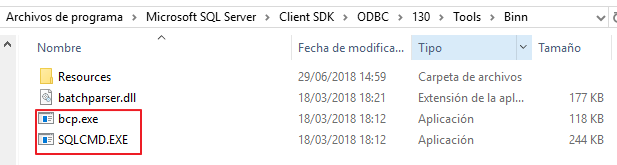

### Utilidad mongoimport de MongoDB 
Verificar que en la carpeta donde está instalado MongoDB se encuentre el archivo mongoimport.exe. Por defecto la ruta de instalación es:
```
C:\Program Files\MongoDB\Server\4.0\bin
```
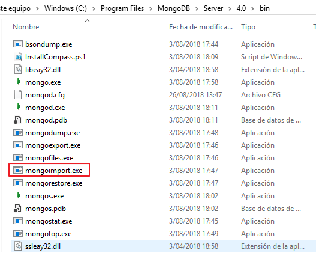

Adicionalmente, se debe comprobar si la ruta está registrada en las variables de entorno del sistema operativo. De no estarlo, ejecutar una consola con privilegios de administrador e ingresar el siguiente comando:

```
setx PATH /m "%path%;C:\Program Files\MongoDB\Server\4.0\bin"
```
## Configuración
### Configuración de cadenas de conexión
Ingresar a la ruta _\conn\sql_ y en cada uno de los archivos, modificar los datos que se muestran en la siguiente imagen:

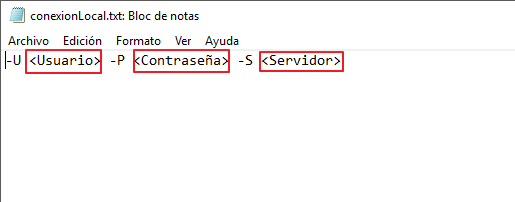

Luego, ir a la ruta _\conn\mongo_ y abrir el archivo __conexionQAs.txt__. Se mostrarán los datos de la cadena de conexión y solo deberá modificar los campos que se muestran en la imagen.

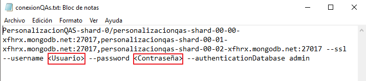

### Configuración de datos de entrada para ofertas personalizadas
Ingresar a la carpeta input y modificar los archivos campanias.txt y palancas.txt. En el primero, se deberán listar cada una de las campañas de ofertas personalizadas que desea cargar a MongoDB, separadas por saltos de línea.

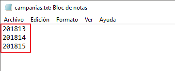

En el segundo archivo, se colocarán las diferentes de palancas de ofertas personalizadas que se migrarán a MongoDB, separadas por saltos de línea.

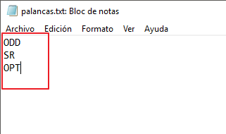

## Ejecución
Si se realizará una carga nueva desde cero a MongoDB, primero debe crear la base de datos y las colecciones con sus respectivos índices, para esto puede utilizar los comandos que se encuentran en el script [CrearColeccionesMongoDB.js](/scripts/CrearColeccionesMongoDB.js), ubicado en la carpeta scripts. Por otro lado, si ya existen datos migrados en MongoDB y lo que se quiere es realizar una nueva carga, debe ejectur el script [RecrearBaseDatosMongoDB.js](/scripts/RecrearBaseDatosMongoDB.js). Con esto, se eliminarán cada una de las colecciones y se volverán a crear con los índices que tenían. 

Posteriormente, seguir los pasos que se muestran a continuación:

1. Ir a la ruta del proyecto y ejecutar el archivo __init.cmd__

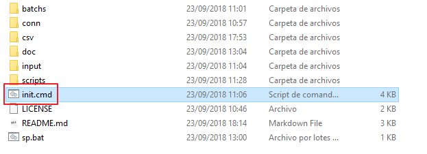

2. Se abrirá la consola y se solicitará que seleccione cual de las cadenas de conexión SQL Server es la que se empleará para obtener los datos de origen.

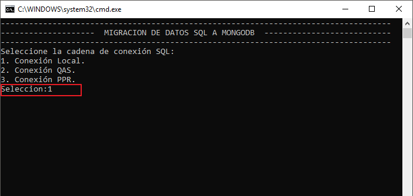

3. Luego, se deberá indicar qué cadena de conexión se empleará para realizar la importación de datos a MongoDB.

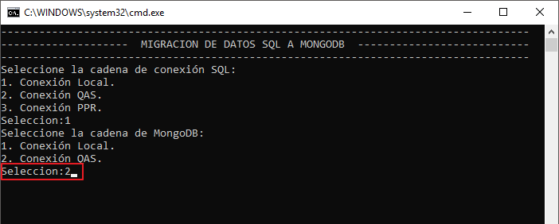

4. Ingresar el nombre de la base de datos SQL Server de donde se obtendrá la información.

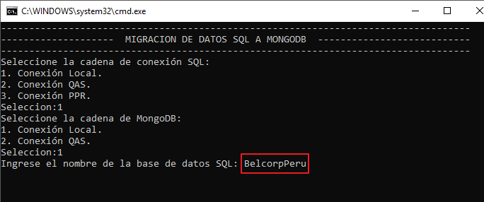

5. Finalmente, escribir el nombre de la base de datos MongoDB donde se insertarán los datos. 

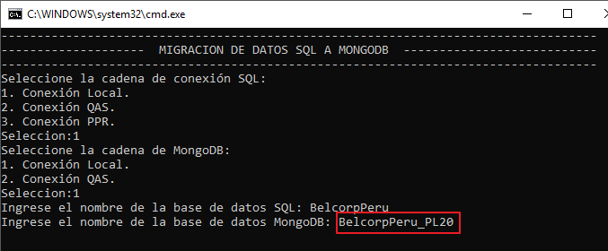

6. Esperar a que finalice el proceso de migración.